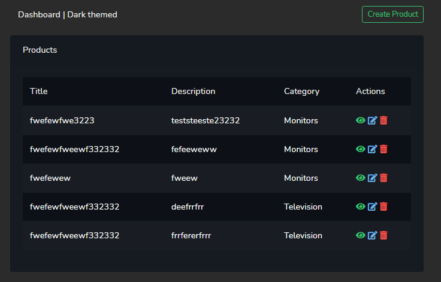

## About this project

This project was made by Nick Ottens, this application is a crud-system made with Laravel and Vue. The front-end (Vue) communicates with the laravel api.

This project contains the following features
- CRUD system
- Validation (Frontend/Backend)
- Error/Success notifications
- Image upload

## Todos
- Language support
- Re-usable components.

## Install Guide

- git clone https://github.com/Ndottens/ProductCRUD-api-vue.git
- cp .env.example .env
Setup your env file (database)
- composer install
- npm install
- php artisan migrate
- php artisan db:seed (Seeder for categories)
- php artisan storage:link
- php artisan key:generate
- php artisan serve
- npm run watch

## Project Structure

You can find the front-end/vue code in resources/js, the front-end communicates with our api (api.php) through axios requests.
Each model has their own module in the frontend where we can call our axios requests globally.

You can find the back-end code in the controllers. We use custom request for security, and we also validate them. There is no need to use services because our controller is already clean enough. 

